## THE-CONVERSIONATOR

## Introduction

The Conversionator is your ultimate travel companion, helping you plan your trips efficiently and calculate costs as well as your CO₂ footprint.

### The live link can be found here - [THE-CONVERSIONATOR](https://lorenz-127.github.io/THE-CONVERSIONATOR/)

Link to [responsive Mockup](https://ui.dev/amiresponsive?url=https://lorenz-127.github.io/THE-CONVERSIONATOR/index.html)
---
## CONTENTS

* [User Experience](#user-experience)
  * [User Stories](#user-stories)

* [Design](#design)
  * [Colours Scheme](#colour-scheme)
  * [Typography](#typography)
  * [Wireframes](#wireframes)

* [Features](#features)
  * [Existing Features](#existing-features)
  * [Features Left to Implement](#features-left-to-implement)
  * [Accessibility](#accessibility)

* [Technologies Used](#technologies-used)
  * [Languages Used](#languages-used)
  * [Programs Used](#programs-used)

* [Deployment & Local Development](#deployment-and-local-development)
  * [Deployment](#deployment)
  * [Local Development](#local-development)
    * [How to Fork](#how-to-fork)
    * [How to Clone](#how-to-clone)

* [Testing](#testing)
* [Refactor](#refactor)

* [Credits](#credits)
  * [Content](#content)
  * [Acknowledgments](#acknowledgements)

## User Experience

### Main Idea

The idea behind the Conversionator is to quickly and clearly answer the most important questions when planning a trip with a vehicle.

- How long will I need for the journey?
- How much will the fuel cost me for the journey?
- What is the exchange rate for the currency at my destination?
- What is my ecological footprint for the journey?

The app answers these four basic questions. The design is optimised for mobile devices from 375px and is therefore an ideal travel companion.

### Project Goal

The aim of this project is to have a handy tool at hand for and on my journey to calculate the most important key data.\
Such as traveling time, fuel costs, currency conversion and ecological footprint of my trip.

### Target Audience

- People who are planning a trip or are on a trip.

### User Goals

- As a user, I can get answers to my important travel questions quickly and easily.
- I have all the information I need to use the app available in an intuitive way.
- The app should be easy to use and also be able to be set up with alternative input methods, such as screen readers or keyboard input without a mouse.

### Site Owner Goals

- As the operator of the app, I offer the user the opportunity to get answers to their most important questions about their trip quickly and easily.
- I also have the opportunity to evaluate their data within the framework of the legal regulations and to inform them with targeted and needs-based advertising or offers.

### User stories

- #### First-Time Visitor Goals

  - As a first-time user of the app, I find my way around quickly and easily.

- #### Returning Visitor Goals

  - As a returning user of the app, I know how the app works and can specifically get the information I need for my current trip.

- #### Frequent User Goals

  - As a regular user of the app, I appreciate its benefits and will include it in my planning of my next trip.

### Owner Goals

- #### First-Time Visitor Goals

  - The first-time visitor finds the app appealing and the information provided helps him to quickly find his way around.

- #### Returning Visitor Goals

  - The returning user gives me the opportunity to evaluate their data and adapt my additional planned content to their needs.

- #### Frequent User Goals

  - Regular users of the app leave a positive review in the app store, thus attracting more customers.

[Top](#contents)

## Design  

### Colour Scheme
- The idea for this colour scheme was to choose a bright theme this time. There are also some additional colours, e.g. for shadows, borders and other indicators that are not in the main palette. 

### Typography
- The fonts for this project are from google fonts.
  - The title font is "Alfa Slab One" serif

  

  - The content font is "Lato" sans-serif

  

[Top](#contents)

### Wireframes 

#### Home

- Desktop
  - Screen size 992px and larger

- Tablet
  - Screen size 768px

- Mobile
  - Screen size 375px 

[Top](#contents)

## Features

### Header

- The design for the header is minimalist. The idea behind it is not to irritate the user with an overloaded header.\
For this reason, I have also deliberately kept the menu icons simple.\
The app's focus should be on the calculators and not on the navigation.

### Footer

- I took the same approach with the footer.\
The icons for the socials are simple and follow the design of the app. 

### Home

- On screens larger than 992px, all 4 calculators are displayed in a grid layout.\
This makes unnecessary scrolling obsolete and allows the user to interact seamlessly with the app.

### Instructions

- Clicking on the question mark icon opens the instruction page, where the operation of the individual calculators is explained.\
The calculators are displayed by selecting the title of the desired calculator.\
This action should enable the user to navigate the page with as few clicks as possible.

- The entire page and all elements can also be operated using the keyboard.

### Overlay Desktop

- In the desktop version, the modal menu only shows the really necessary links to minimize distractions for the user.
- The overlay menu closes by click on the prominent close icon, with ESC, or backspace key pressed.

### Mobile

- On mobile devices, the user has the option of displaying the calculators either individually or all the calculators in one column.

### Overlay Mobile

- In the mobile version of the modal, all links are displayed, as the user has the option of displaying the calculators individually.

[Top](#contents)

---

### Existing Features

### Travel Time
  - Calculates your estimated traveling time by entering your speed and the desired distance.

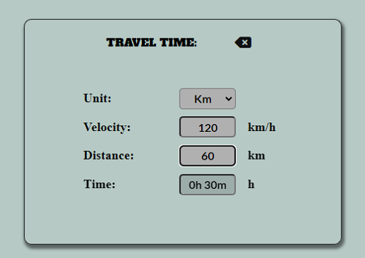

### Currency Calculator
  - Calculates your foreign currency for euros, pounds sterling and US dollars.

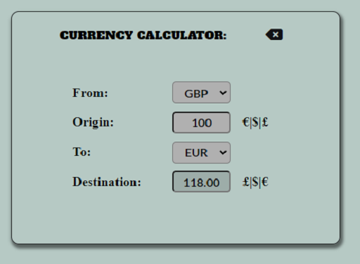

### Travel Cost
  - Calculates the cost of your journey by entering the distance, fuel consumption and fuel costs.

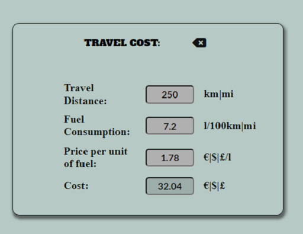

### CO₂ Footprint
  - Calculates how big the ecological footprint of the journey will be. 

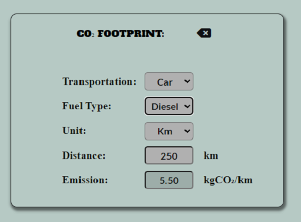

### Menu Icons
- The classic burger menu opens the modal with the navigation.
- The question mark icon opens the Instructions page.

### Reset Buttons
- The Reset button resets the input of the fields.

[Top](#contents)

### Accessibility

- I used alt="", aria-labels and semantic elements like as much as possible to make the site easy to navigate and understand by keyboard and/or screen reader users.

- All icons on the page scale by a factor of 1.7 when clicked to give the user visual feedback for their action.

- The overlay menu closes by click, with ESC, or backspace key, all fields can be accessed using the tab key.

- The fields update themselves automatically as soon as the required parameters are entered.\
Therefore, an additional action such as pressing the enter key or clicking a calculate button is not necessary.

### Features Left to Implement

- API access for the currency calculator to get live conversion rates

- Integration of Google Maps for live traffic forecasts and route planning.

- Weather app to forecast the conditions for your journey.

- Theme toggle that the user can switch between dark and light mode.

- Add login and registration to give users the opportunity to plan and manage trips in advance.

[Top](#contents)

## Testing

- ### [Link to testing.md](testing.md)

## Refactor 

- ### [Link to refactor.md](refactor.md)

### Bug Fixes in the Production Process

#### Navigation

- M-Issue-01: The links to the individual calculators do not work in the mobile view. The blur effect shifts when clicking on the links.
- M-Issue-02: The links in the instruction section do not work in the mobile view.

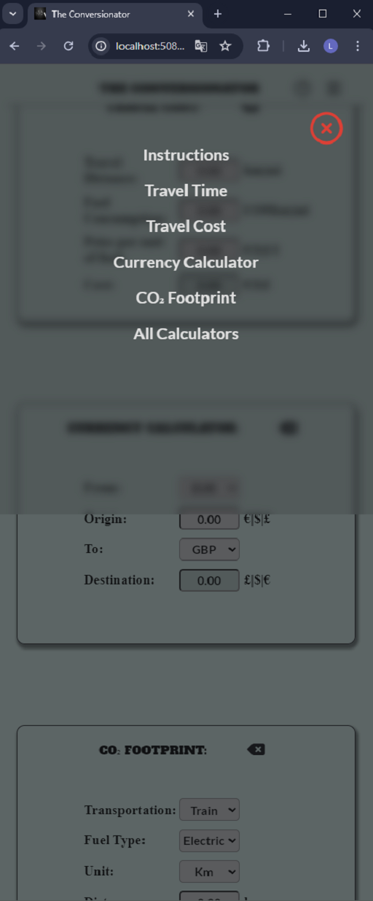

  - Solution: The navigation for smaller screens was not functional.\
  For this reason, I separated the code for the navigation from the main code for the calculators and completely rewrote it.\
  I have documented this process separately [here]. 
  The visual solution for the user can be seen in the following image.

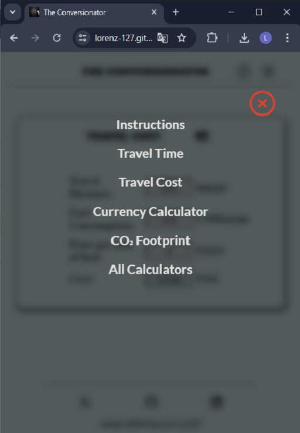

#### Script

- S-Issue-01: The input field allow to typed letter into any of the calculators.
- S-Issue-02: Minus numbers are possible to input into the calculators.

  - Solution: Add an alternative method for field validation in JavaScript, as the usual method is not possible due to the needed form input element type=‘text’.\
  This is the case because the function to replace the comma in the output field with a dot, relies on a type=‘text’ attribute instead of an input type=‘number’.

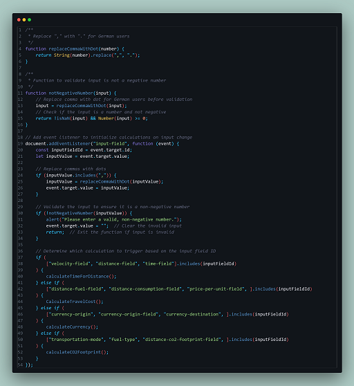

- S-Issue-04: Function to calculate travel cost is not working

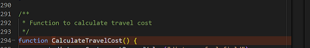

  - Solution: Add correct syntax for function name in camelCase

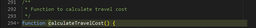

### Bug Fixes through/after validation

- **Error-1** Duplicate attribute 

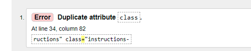

  - Solution: Move attribute "instructions-btn" inside existing class element and delete duplicated class element.

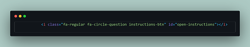

- **Error-2+3** End tag section wrong indentation but there were open div element.

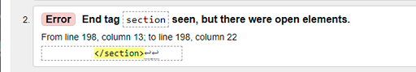

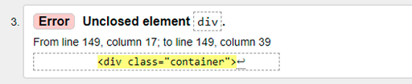

  - Solution: Add forgotten end tag of DIV element. Correct indentation for section element.

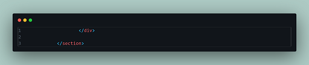

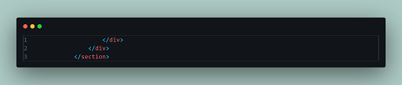

- **Error-4~17** Element p not allowed as child of ul in this context.

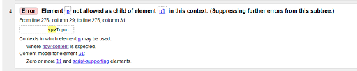

  - Solution: Change HTML Structure set div for ul and h5 for li elements see [Commit-File](https://github.com/Lorenz-127/THE-CONVERSIONATOR/commit/be44a4a6154b03abdf156646860f13987f858a76#diff-0eb547304658805aad788d320f10bf1f292797b5e6d745a3bf617584da017051L269-R325)

### Bug Fixes caused through changes after validation

**Error-V1** Attribute step not allowed on element input

- This new error arose after the attempt to resolve the error S-Issue-1 + S-Issue-01.

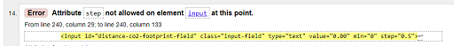

  - Solution: Remove the attributes no longer required for input validation.

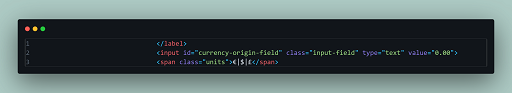

[Top](#contents)

### Unfixed Bugs

#### Calculators

CC-Issue-1: Possibly add a switch currency button to swap the two currently in play

##### Travel Time

- S-Issue-03: Time in hours seems top be a little glitchy when adding a value, then converting from miles -> km -> miles. It says it takes 37 mins to go 1m at 1 mph

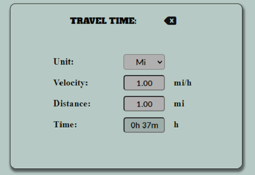

  - Solution:

## Technologies Used

**Github** - Used for storage of my site and for publishing online.\
**Gitpod** - The IDE used for editing my site and pushing changes.\
**Python** - Used python 3 via terminal to preview my site using a local http server.\
**HTML** - The core of the site was built with HTML version 5.\
**CSS** - CSS was used to style the website and define fonts and layout.\
**JavaScript** - JavaScript was used for the logic elements on the website.\
**Font Awesome** - icons are from Font Awesome.\
**Cloudflare** - I use Cloudflare as a library-host for the Font Awesome.\
**Google Chrome** - The website was tested in google Chrome dev tools.\
**Favicon Generator Website** - The favicon was made by favicon.io\

### Languages Used

- **HTML**
- **CSS**
- **JavaScript**

### Programs Used

- **Github**   - I GitHub for the storage of my site and Gitpages to publish my website.
- **Balsamiq** - Balsamiq was the choice for the wireframes.
- **MS-Paint** - MS-Paint for some of my image resizing.
- **VS-Code**  - VS-Code Desktop for various testing on a save playground.
- **Slack**    - Slack to communicate with my Mentor, Peers and get some help and infos.

[Top](#contents)

# Deployment and Local Development

## Deployment

The site is deployed using GitHub Pages - [THE-CONVERSIONATOR](https://lorenz-127.github.io/THE-CONVERSIONATOR/)

To Deploy the site using GitHub Pages by following these steps:

1. Login (or signup) to Github.
2. Go to the repository for this project, [lorenz-127/THE-CONVERSIONATOR](https://github.com/Lorenz-127/THE-CONVERSIONATOR).
3. Click the settings button.
4. Select pages in the left hand navigation menu.
5. From the source dropdown select main branch and press save.
6. The site has now been deployed, please note that this process may take a few minutes before the site goes live.

## Local Development

### How to Fork

To fork the repository:

1. Log in (or sign up) to Github.
2. Go to the repository for this project, [lorenz-127/THE-CONVERSIONATOR](https://github.com/Lorenz-127/THE-CONVERSIONATOR)
3. Click the Fork button in the top right corner.

### How to Clone

To clone the the repository:

1. Log into your account on github
2. Go to the repository of this project [lorenz-127/THE-CONVERSIONATOR](https://github.com/Lorenz-127/THE-CONVERSIONATOR)
3. Click on the code button, and copy your preferred clone link.
4. Open the terminal in your code editor and change the current working directory to the location you want to use for the cloned directory.
5. Type 'git clone' into the terminal, paste the link you copied in step 3 and press enter.

[Top](#contents)

# Credits

### Styles, Icons, Images

### JavaScript

- Some of the functions are adaptations of the various lessons taught by CI's own LMS.
- Most of my JavaScript questions was answered by [MDN web docs](https://developer.mozilla.org/en-US/docs/Web/JavaScript)
- For harder coding questions, I used Co-Pilot as an assistant, which is provided by the CI GitHub Student Pack.

[Top](#contents)

### Content
- The text on the website is written entirely by me. However, I have used [deepl.com](https://www.deepl.com/translator) for some parts of the translation.
- The inspiration for the Modal Overlay Menu I got from [W3schools](https://www.w3schools.com/howto/howto_js_curtain_menu.asp)

### Acknowledgements

- My Peers in various Code Institute's Slack channels for their feedback and support.
- All the great videos that are periodically posted by slack-bot in the various channels (**You're a legend!**).
- Erik_4P_Lead for his advice and tips in early production process. [LinkedIn](https://www.linkedin.com/in/erikas-ramanauskas-full-stack-developer/) [GitHub](https://github.com/Erikas-Ramanauskas)
- Tomáš_Kubánčik_Alumni_lead For additional advice on solving JavaScript bugs. [LinkedIn](https://www.linkedin.com/in/tomas-kubancik/) [GitHub](https://github.com/tomik-z-cech)

### Honourable mentions

- I would like to thank my mentor Luke Buchanan, for great feedback and advice.

- Vernell for his valuable and patient advice and tips to find the right path for solution. [LinkedIn](https://www.linkedin.com/in/vernellclark/) [GitHub](https://github.com/VCGithubCode)

[Top](#contents)

