## THE-CONVERSIONATOR

## Introduction

### The live link can be found here - [THE-CONVERSIONATOR](https://lorenz-127.github.io/THE-CONVERSIONATOR/)

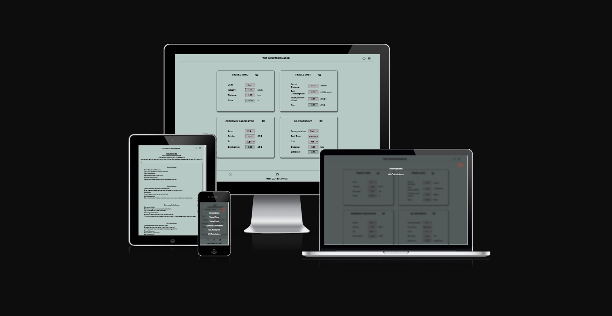

Link to [responsive Mockup](https://ui.dev/amiresponsive?url=https://lorenz-127.github.io/THE-CONVERSIONATOR/index.html)
---
## CONTENTS

* [User Experience](#user-experience)
  * [User Stories](#user-stories)

* [Design](#design)
  * [Colour Scheme](#colour-scheme)
  * [Typography](#typography)
  * [Wireframes](#wireframes)

* [Features](#features)
  * [Existing Features](#existing-features)
  * [Features Left to Implement](#features-left-to-implement)
  * [Accessibility](#accessibility)

* [Technologies Used](#technologies-used)
  * [Languages Used](#languages-used)
  * [Programs Used](#programs-used)

* [Deployment & Local Development](#deployment-and-local-development)
  * [Deployment](#deployment)
  * [Local Development](#local-development)
    * [How to Fork](#how-to-fork)
    * [How to Clone](#how-to-clone)

* [Testing](#testing)

* [Credits](#credits)
  * [Content](#content)
  * [Acknowledgments](#acknowledgements)

## User Experience

### Main Idea

### Project Goal

### Target Audience

### User Goals

### Site Owner Goals

### User stories

- #### First-Time Visitor Goals

- #### Returning Visitor Goals

- #### Frequent User Goals

### Owner Goals
- #### First-Time Visitor Goals

- #### Returning Visitor Goals

- #### Frequent User Goals

[Top](#contents)

## Design  

### Colour Scheme
- The idea for this colour scheme was to choose a bright theme this time. There are also some additional colours, e.g. for shadows, borders and other indicators that are not in the main palette. 

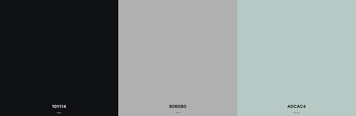

### Typography
- The fonts for this project are from google fonts.
  - The title font is "Alfa Slab One" serif

  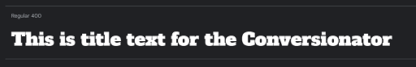

  - The content font is "Lato" sans-serif

  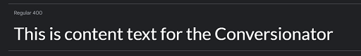

[Top](#contents)

### Wireframes 

#### Lofi Design

#### Home

- Desktop
  - Screensize 992px and larger

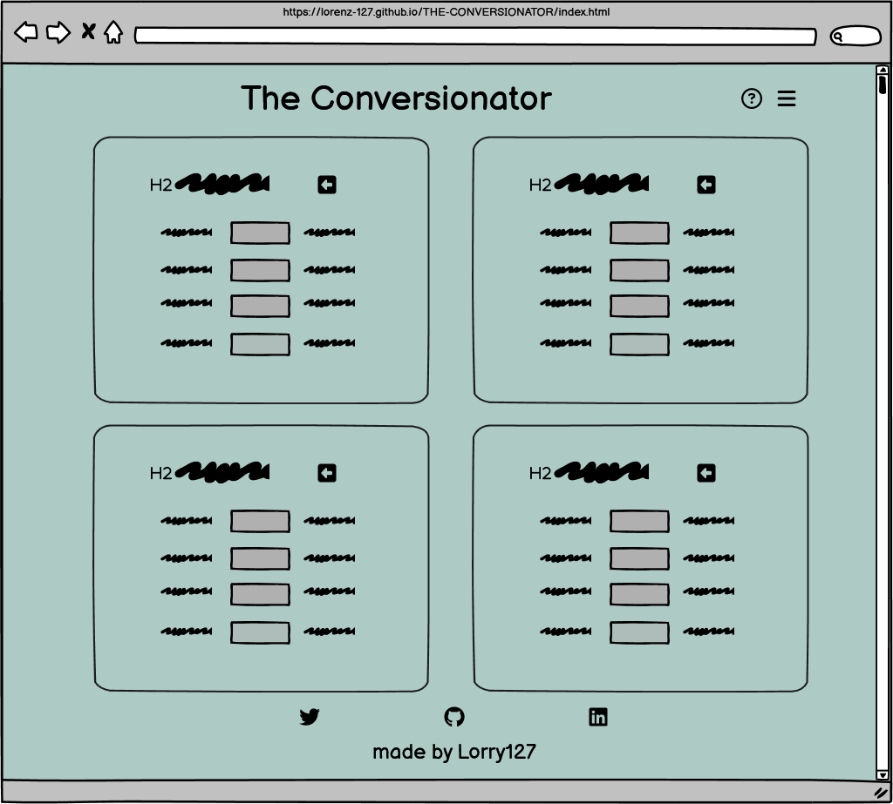

- Tablet
  - Screensize 768px

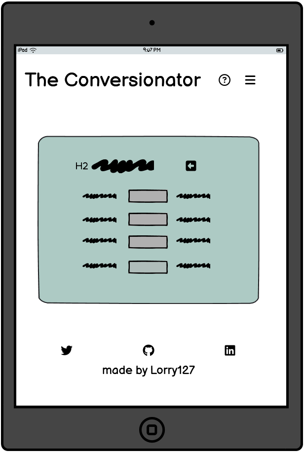

- Mobile
 - Screensize 375px 

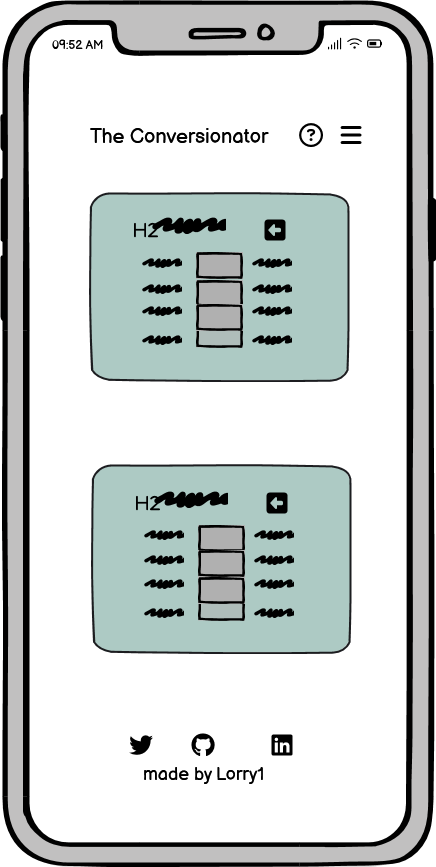

[Top](#contents)

## Features

### Header

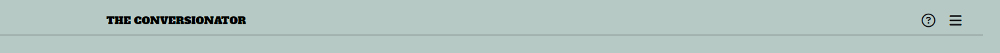

### Footer

### Home

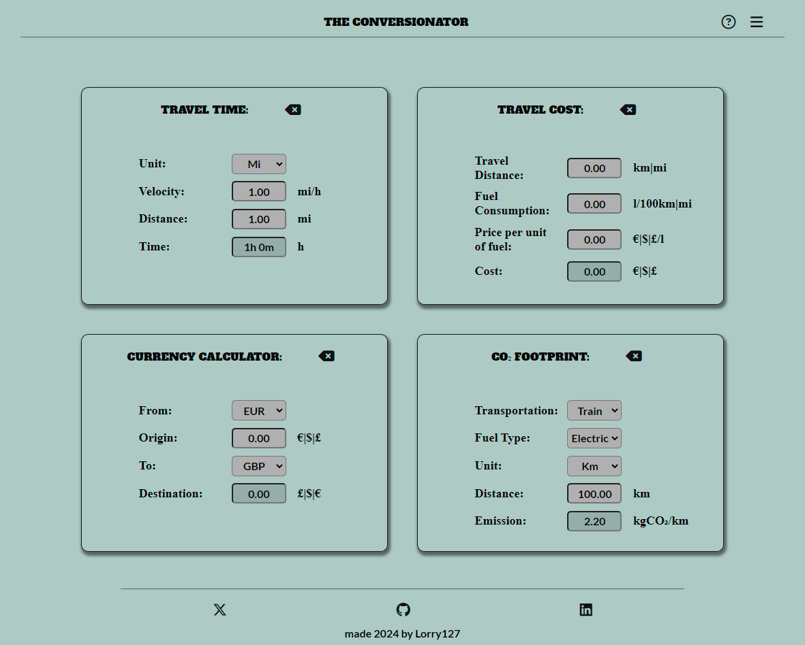

### Instructions

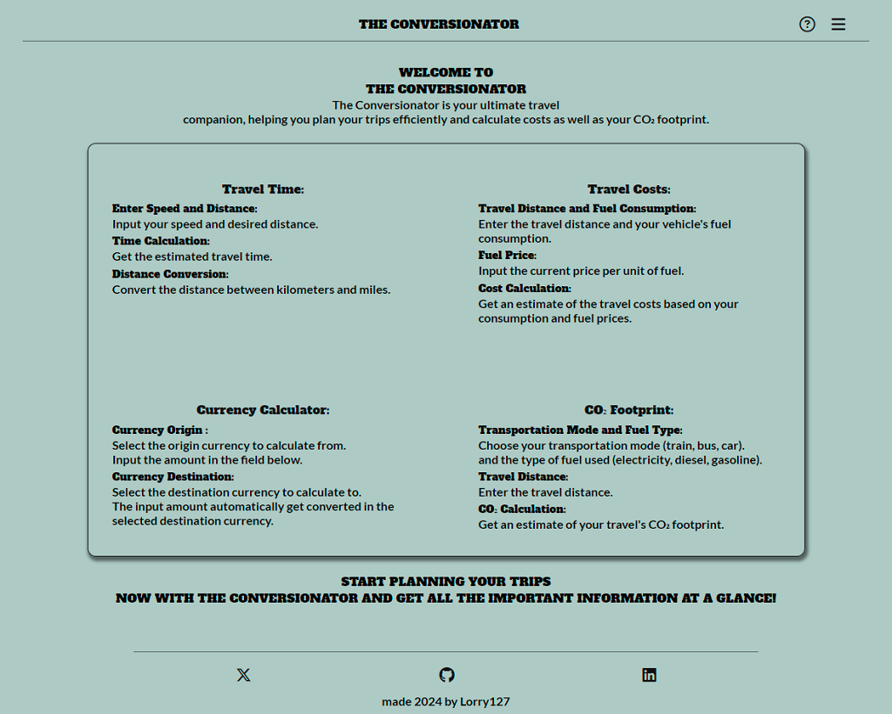

### Overlay Desktop

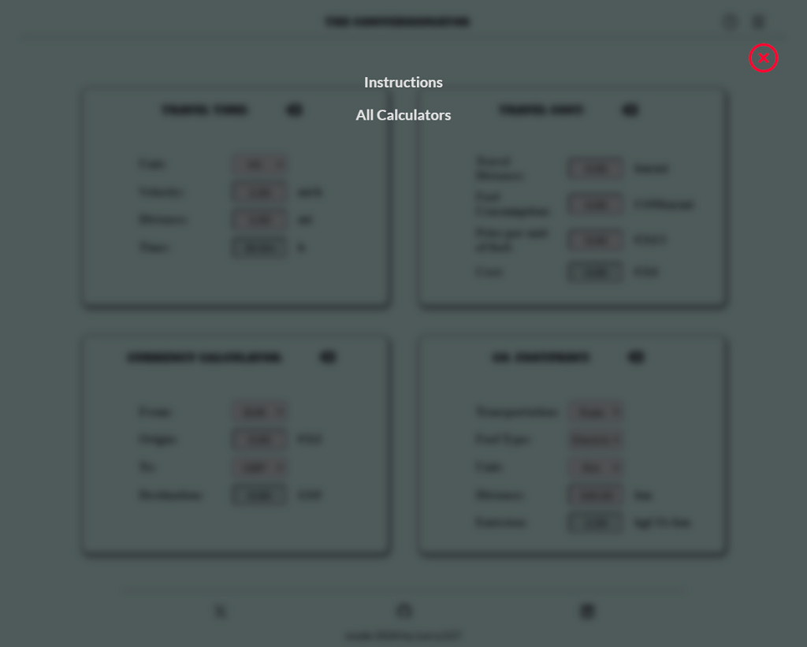

### Mobile

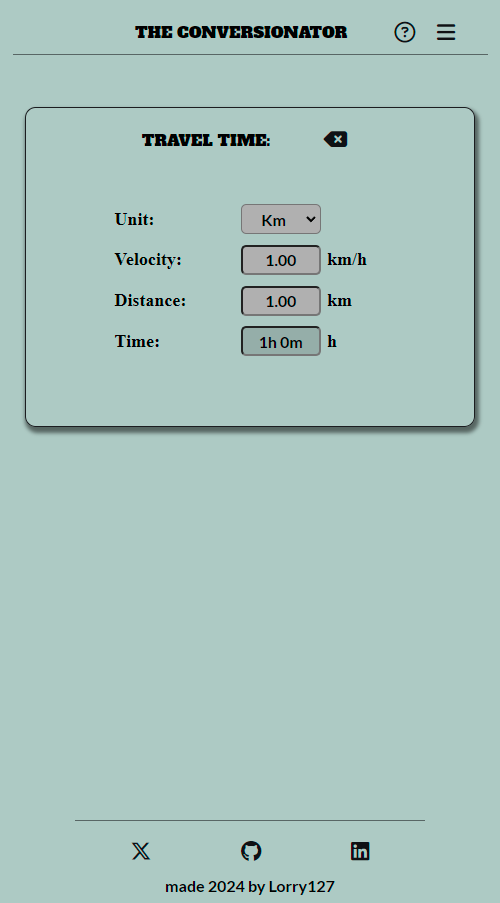

### Overlay Mobile

[Top](#contents)

---

### Existing Features

### Feature 1

### Feature 2

[Top](#contents)

### Accessibility

### Features Left to Implement

#### Feature 1

[Top](#contents)

## Testing

- ### [Link to testing.md](testing.md)

### Bug Fixes in the Production Process

### Bug Fixes through after validation

### Bug Fixes caused through changes after validation

[Top](#contents)

### Unfixed Bugs

#### Navigation
- M-Issue-01: The links to the individual calculators do not work in the mobile view. The blur effect shifts when clicking on the links.
  - Solution:
- M-Issue-02: The links in the instruction section do not work in the mobile view.
  - Solution:

#### Calculators
- S-Issue-01: The input field allow to typed letter into any of the calculators.
  - Solution:
- S-Issue-02: Minus numbers are possible to input into the calculators.
  - Solution:
- S-Issue-02: Time in hours seems top be a little glitchy when adding a value, then converting from miles -> km -> miles. It says it takes 37 mins to go 1m at 1 mph
  - Solution:

##### Travel Time
- TT-Issue-01: If the user selects miles as the start calculation, the conversion is incorrect. If he sets the selection to km and back to mi, the result is correct.

## Technologies Used

**Github** - Used for storage of my site and for publishing online.\
**Gitpod** - The IDE used for editing my site and pushing changes.\
**Python** - Used python 3 via terminal to preview my site using a local http server.\
**HTML** - The core of the site was built with HTML version 5.\
**CSS** - CSS was used to style the website and define fonts and layout.\
**JavaScript** - JavaScript was used for the logic elements on the website.\
**Font Awesome** - icons are from Font Awesome.\
**Cloudflare** - I use Cloudflare as a library-host for the Font Awesome.\
**Google Chrome** - The website was tested in google Chrome dev tools.\
**Favicon Generator Website** - The favicon was made by favicon.io\

### Languages Used

- **HTML**
- **CSS**
- **JavaScript**

### Programs Used

- **Github**   - I GitHub for the storage of my site and Gitpages to publish my website.
- **Balsamiq** - Balsamiq was the choice for the wireframes.
- **MS-Paint** - MS-Paint for some of my image resizing.
- **VS-Code**  - VS-Code Destop for various testing on a save playground.
- **Slack**    - Slack to communicate with my Mentor, Peers and get some help and infos.

[Top](#contents)

# Deployment and Local Development

## Deployment

The site is deployed using GitHub Pages - [THE-CONVERSIONATOR](https://lorenz-127.github.io/THE-CONVERSIONATOR/)

To Deploy the site using GitHub Pages by following these steps:

1. Login (or signup) to Github.
2. Go to the repository for this project, [lorenz-127/THE-CONVERSIONATOR](https://github.com/Lorenz-127/THE-CONVERSIONATOR).
3. Click the settings button.
4. Select pages in the left hand navigation menu.
5. From the source dropdown select main branch and press save.
6. The site has now been deployed, please note that this process may take a few minutes before the site goes live.

## Local Development

### How to Fork

To fork the repository:

1. Log in (or sign up) to Github.
2. Go to the repository for this project, [lorenz-127/THE-CONVERSIONATOR](https://github.com/Lorenz-127/THE-CONVERSIONATOR)
3. Click the Fork button in the top right corner.

### How to Clone

To clone the the repository:

1. Log into your account on github
2. Go to the repository of this project [lorenz-127/THE-CONVERSIONATOR](https://github.com/Lorenz-127/THE-CONVERSIONATOR)
3. Click on the code button, and copy your preferred clone link.
4. Open the terminal in your code editor and change the current working directory to the location you want to use for the cloned directory.
5. Type 'git clone' into the terminal, paste the link you copied in step 3 and press enter.

[Top](#contents)

# Credits

### Styles, Icons, Images

### JavaScript

[Top](#contents)

### Content
- The text on the website is written entirely by me. However, I have used [deepl.com](https://www.deepl.com/translator) for some parts of the translation.
- For some coding questions, I used Co-Pilot as an assistant, which is provided by the CI GitHub Student Pack.
- Most of my JavaScript questions was answered by [MDN web docs](https://developer.mozilla.org/en-US/docs/Web/JavaScript)
- The inspration for the Modal Overlay Menu i took from [W3schools](https://www.w3schools.com/howto/howto_js_curtain_menu.asp)

### Acknowledgements

- My Peers in various Code Institute's Slack channels for their feedback and support.
- All the great videos that are periodically posted by slack-bot in the various channels (You're a legend!).
- Erik_4P_Lead for his advice and tips. 

### Honourable mentions

- I would like to thank my mentor Luke Buchanan, for great feedback and advice.

- Vernell for his valuable and patient advice and tips to find the right path for solution. [LinkedIn](https://www.linkedin.com/in/vernellclark/) [GitHub](https://github.com/VCGithubCode)

[Top](#contents)

