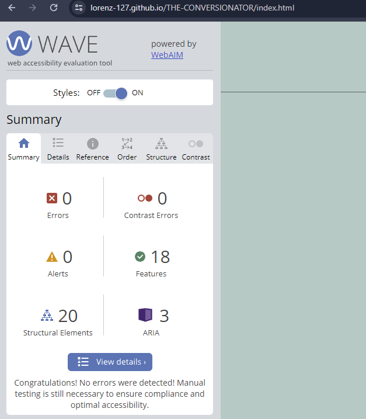
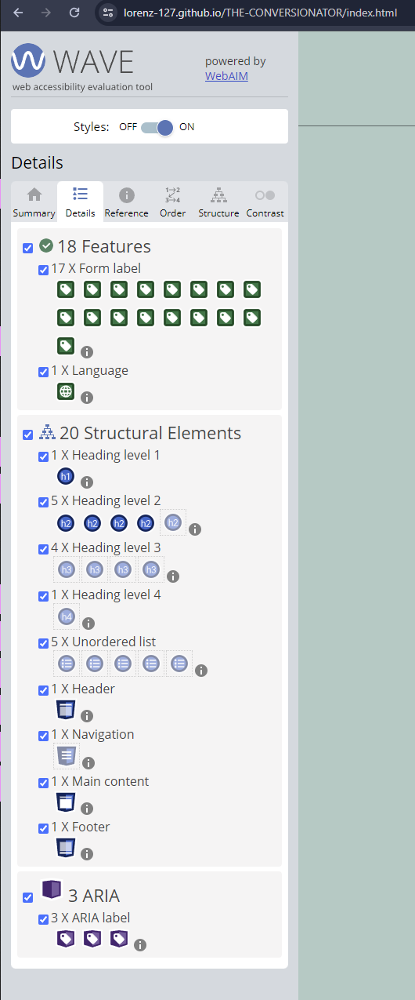
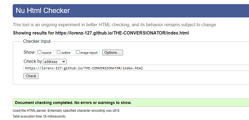
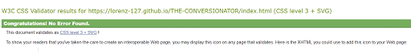
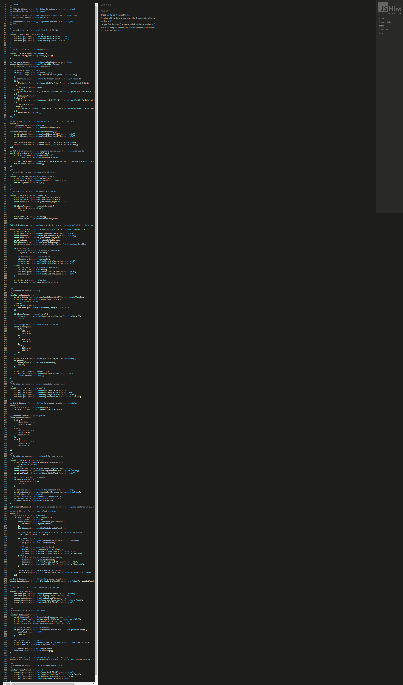
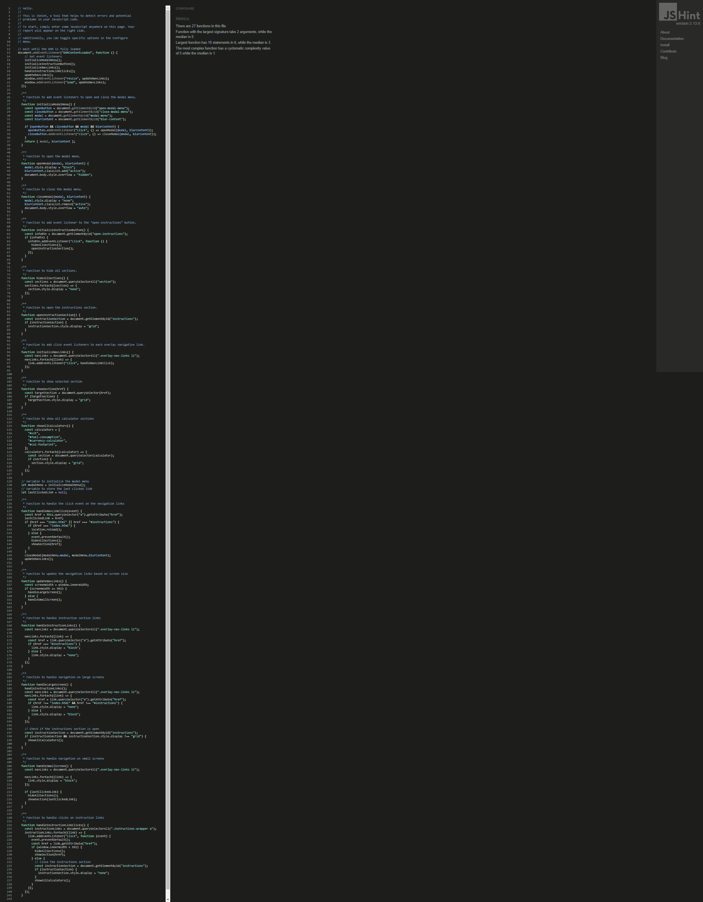
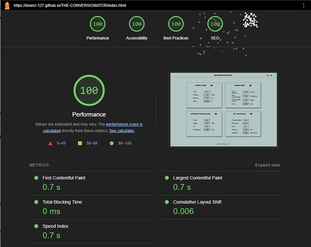

# Tests

## Manual Testing

  - [Lighthouse](#lighthouse)
  - [HTML](#html)
  - [External Testing](#external-testing)
  
## Validator Testing

### Home

- index.html

- index.html with overlay

  - pass

[Top](#tests)

### HTML

#### Home

  - pass

### CSS

  - pass

### JSHINT

  - script.js
    - pass

  - navigation.js
    - pass

[Top](#tests)

## Lighthouse

### Home

[Top](#tests)

## External Testing

### **Testing via Google Chrome Developer Tools**
- **Task :** To test the project for responsiveness in Google Chrome Developer Tools, to ensure correct `@media screen and (max-width: ... )` is enabled and all elements of the project are responding to changing view-port.
- **Method :** Project was displayed via Google Chrome browser, Developer tools were opened and view-port size changed to different sizes.
- **Expected result :** Project does response to min-width **375px** (mobile phones), width **650px** (small tablets), width **768px** (tablets), and max-with **992px** (laptop and up)
- **Actual result :** Project is fully responsive to min-width **375px** (mobile phones), width **650px** (small tablets), width **768px** (tablets), and max-with **992px** (laptop and up)

[Top](#tests)

### **Local testing by developer**
- **Task :** To physically test the final project responsiveness on different devices with different view-ports.
- **Method :** Project was tested on following devices : 
  - Samsung A22 - mobile phone with small view-port 384px
  - Samsung Galaxy S20Ultra - mobile phone with large view-port 412px
  - Dell Laptop Latitude 3590 - Laptop with large view-port
  - PC with resolution 1920px * 1080px (Full HD)  
  - PC with resolution 2560px * 1440px (UHD)
- **Expected result :** The project reacts on all devices without deviations.
- **Actual result :**  No content is out of place on all devices above.
- **Overall result :** Pass
---
- **Task :** Physical test of final project functionality.
- **Method :** Project was tested in following applications : 
  - Google Chrome
  - Mozilla Firefox
  - Microsoft Edge
  - Opera
  - Safari
- **Expected result :** Project does all functions in all web browsers.
- **Actual result :**  The content is not displayed incorrectly in any of the browsers listed, and the project retains its functionality, all navigation links work.
- **Overall result :** Pass
---
- **Task :** Physical testing of navigation in all browsers and sizes.
- **Method :** Test all navigation links and their behaviour, including scaling up on hover and displaying the correct content on click.
- **Expected result :** All links show the expected behaviour and lead to the defined anchors.
- **Actual result :**  The links lead to the defined targets and scale as expected.
- **Overall result :** Pass

[Top](#tests)

---

### **Physical testing by users**
- **Task :** Testing the usability and finding possible bugs that are not already known and have been overlooked.
- **Method :** The test group get access to published links on GitHub pages and send feedback after their test.

|User|Joshua B.|
|--|--|
| Feedback | All Calculators work as intended. The Currency Calculator could have a swap function |
| Applied changes | Due to less then 24h until submission, the swap function on is on the added to "Features Left to Implement" List |
---
|User|Tina B.|
|--|--|
| Feedback given | The App was tested on mobile only and all calculators and links worked perfect. |
| Applied changes | none. |
---
|User|Nicolas T. |
|--|--|
| Feedback given | The App works fine. It is possible to add spaces and infinite numbers to the input fields. |
| Applied changes | Add additional validation to the input fields. [Commit](https://github.com/Lorenz-127/THE-CONVERSIONATOR/commit/da201b71ecb44d18b6da8694f88b6acb860026ba) |
---

[Top](#tests)

- - -
